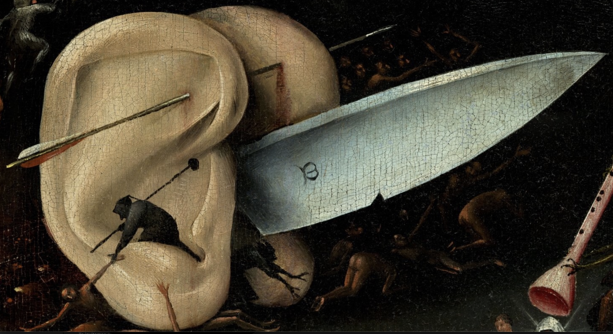
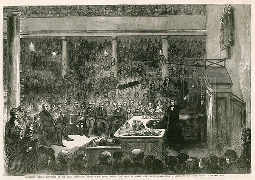
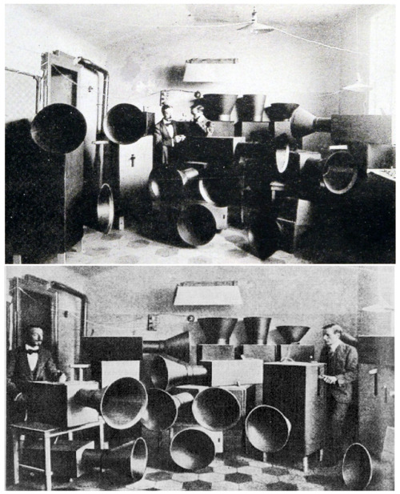
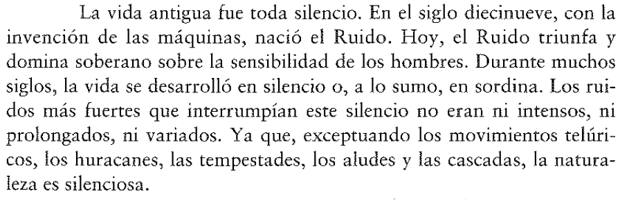

# imagen-elixir

bitácora del curso dictado por cynthia shuffer en doctorado artes y humanidades

## Encargo 1 (24 de agosto)

*Comentar problema de investigación. Describir el problema desde los bordes hacia afuera. Todo lo que no es el centro del problema. Se puede problematizar la noción de borde. Buscar palabras sin separabilidad, tratar el objeto de manera fuzzy, distinguir el entramado que rodea al objeto. Ejemplos: Si investigo flores, fijarme en raíces, si investigo cuerpo, pensar el suelo*

Mi problema de investigación refiere a la cuestión del sonido y su ontología desde un punto de vista materialista y realista, y desde la pregunta por sus condiciones de posibilidad. Ante la vieja pregunta de la caída un árbol en el bosque cuyo sonido no es oído, mi inquietud se dirige hacia el qué fue lo que generó que ese árbol se cayera, que emergiera, o que formara un conglomerado llamado bosque. Mi pregunta que parte en el fenómeno sonoro se desvía hacia más bien la noción de emergencia, de los procesos morfogenéticos que conforman las entidades naturales, y que desde una noción inmanentista, entiende que nada que exista puede ser ajeno a la naturaleza.

Pensando en el borde, considero que el límite de una ontología es fácil de trazar cuando pensamos en objetos masivos y aparentemente definidos por contornos de manera clara, como las mesas, los vasos o los edificios. Sin embargo, si seguimos sosteniendo la idea de que nada que exista puede estar fuera de la naturaleza, cabe plantearse el lugar que ocupan aspectos como el lenguaje, el pensamiento o la experiencia, los que epistémicamente se encuentran separados del campo de la ciencia, campo del conocimiento al que occidente le releva el lidiar con lo que pasa ahí afuera de nosotrxs. El planteamiento de mi problema busca en su esencia difuminar ese borde que ha alejado a la naturaleza de las humanidades. El entendimiento del sonido y su estatus paradójico, de aparentemente estar situado en varias partes a la vez (¿está ahí afuera, en un órgano sensible, o algo que ensambla mi cerebro?) permitiría operar como soldadura disciplinar para aproximarnos a una cosmología que permita observar con igual interés e igual condición de realidad a los procesos que llevan a la conformación de montañas, a la producción del lenguaje hablado, y al flujo de la imaginación.

## Encargo 2 (7 de septiembre)

*Tarea 2 – elegir una imagen para intervenir el problem*

### Alternativa 1

Detalle de El Jardin de las Delicias - El Bosco (1550~1505)

### Alternativa 2

Professor Faraday lecturing at the Royal Institution before HRH Prince Albert, the Prince of Wales, and Prince Alfred; from a sketch by Alexander Blaikley; from The Illustrated London News, 16 February 1856.

<https://mappingignorance.org/2015/11/19/the-unrehearsed-lecture-that-changed-the-physics-of-light/>

### Alternativa 3

Instruments built by Russolo, photo published in his 1913 book The Art of Noises

<https://commons.wikimedia.org/wiki/File:Russolointonorumori.jpg>

La imagen aparece publicada dentro de "el arte de los ruidos" (1913). Quizás por el alcance de nombre, se suele situar a esta publicación como el golpe de timón que le dio a la música la vanguardia futurista, y que se encuentra como hito fundacional en cualquier intento de historia del "Arte Sonoro". Las fotografías dejan ver a dos varones bien vestidos, uno de ellos siendo Russolo. El futurismo, bien sostenido en la violencia, el ruido de balas y la fetichización de lo avasallador, propone a la creación sonora como una máquina de guerra. Pero curiosamente, este ejército estaba diseñado para pelear en el campo de batalla de los salones de concierto. Buscaba dejar que estas armas sónicas entraran a la orquesta, sin desarmar este ring, sin redirigir la batalla hacia un terreno geográfico más favorable. De hecho, se pueden encontrar algunas partituras en pentagramas con los movimientos de líneas de las melodías que intentaban representar a través de las escopetas escopetas cónicas. El arte de lo ruidoso es una celebración domesticada que poco le hace a la supuesta quietud de la naturaleza.

