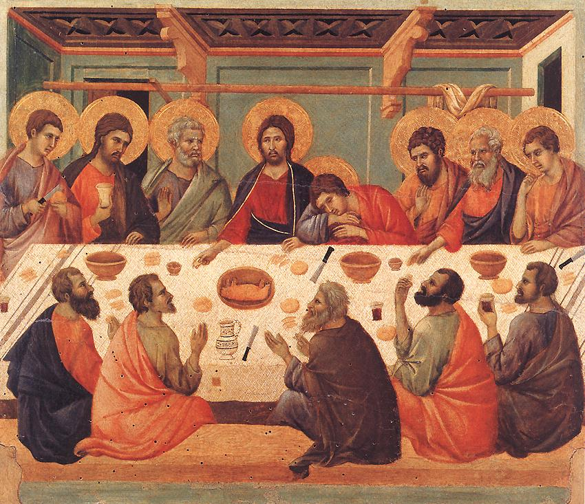
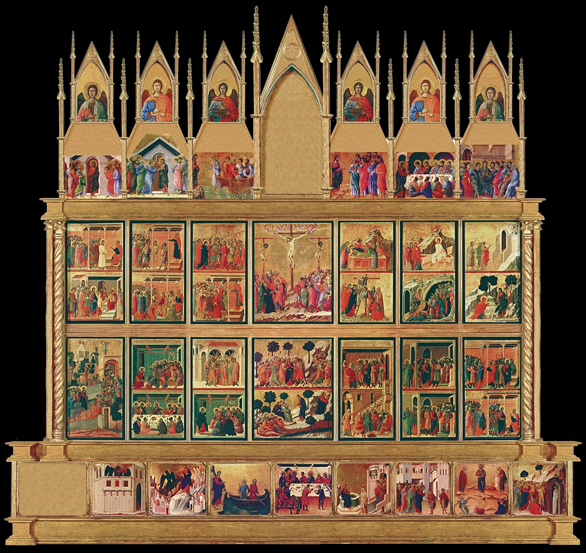
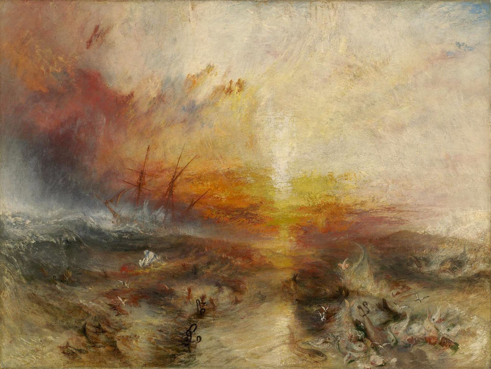
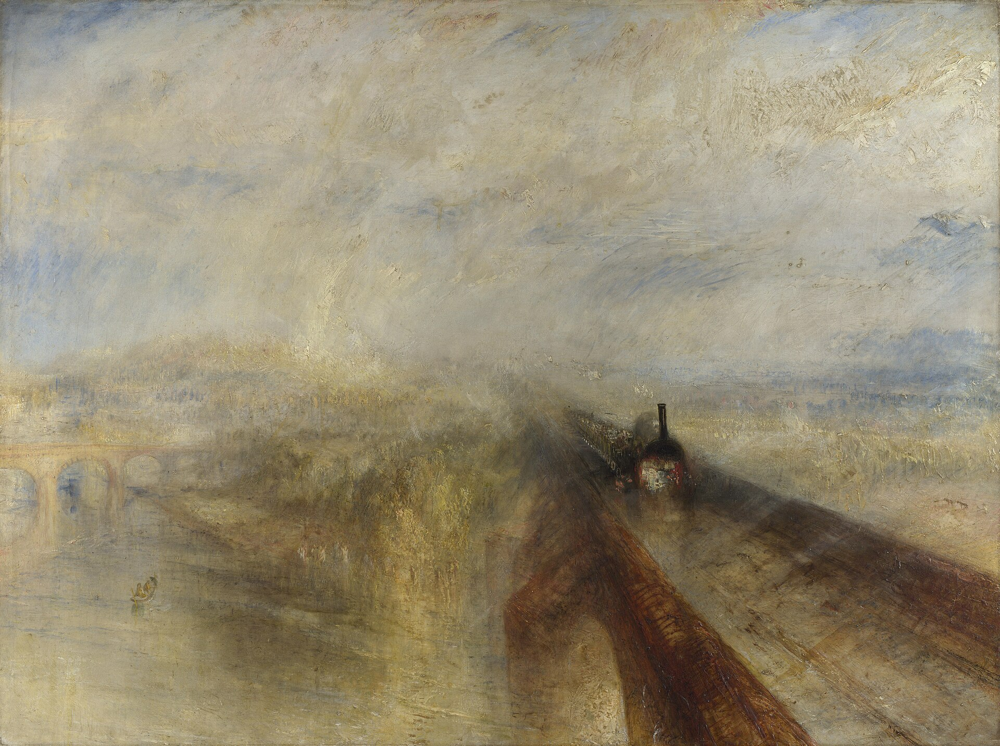
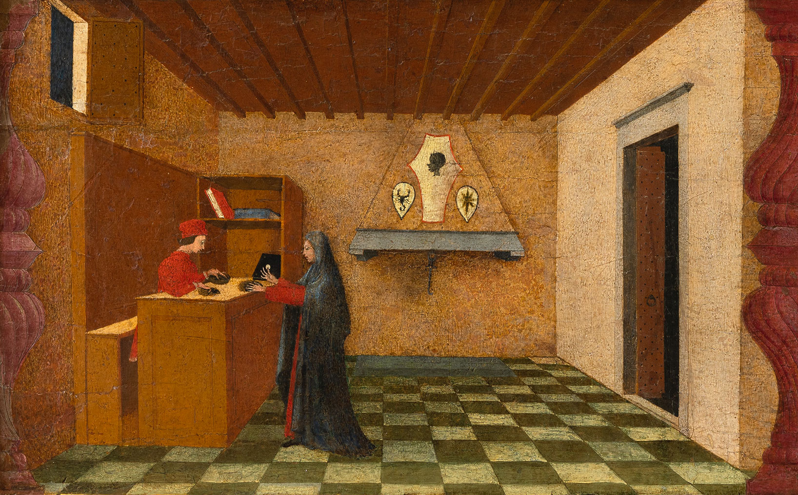
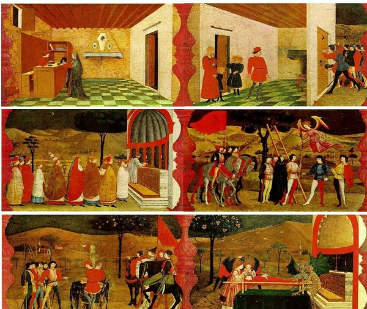
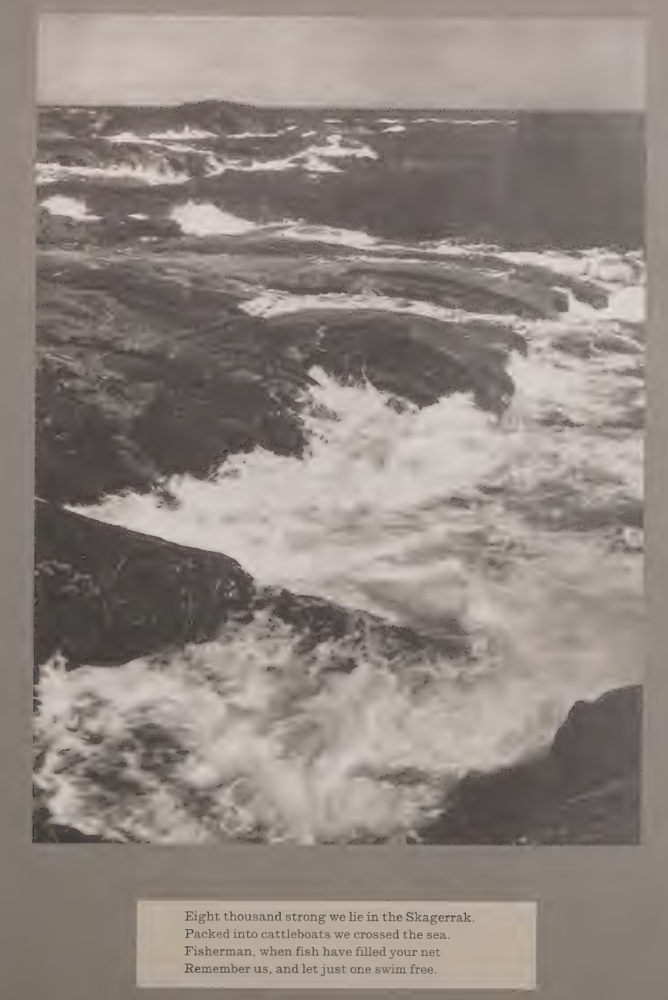
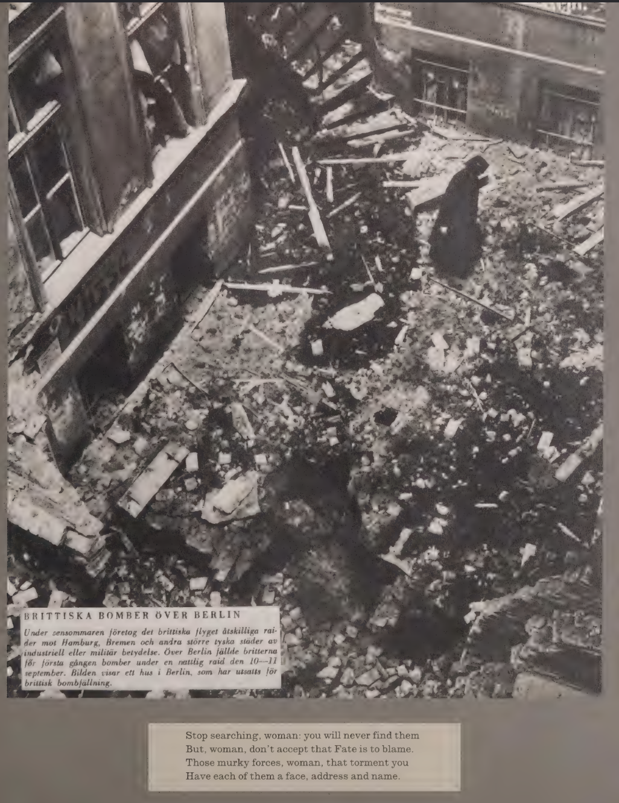

# Animación textos Steyerl y Didi-Huberman (21 septiembre)

Última cena (Duccio di Buoninsegna, 1308-11)

Maestà (Duccio di Buoninsegna, 1308-11)

Se trata de un retablo de dos caras: en el anverso figura una gran escena con la Virgen y el Niño rodeada de ángeles y santos, junto a otras escenas menores, mientras que en el reverso se encuentran veintiséis escenas de la Pasión de Cristo, además de otros episodios en el ático y la predela. 

Slave ship (Turner, 1840)

Rain, Steam and Speed (Turner, 1844)

Miracolo dell'Ostia Profanata (Uccello, 1465-68)

Miracolo dell'Ostia Profanata (Uccello, 1465-68)

---

Ocho mil somos los que yacemos en el Skagerrak.

Hacinados en barcos de ganado cruzamos el mar.

Pescador, cuando tu red se llene de peces,

recuérdanos, y deja que uno solo nade libre.

Deja de buscar, mujer: nunca los encontrarás.

Pero, mujer, no aceptes que la culpa sea del Destino.

Esas fuerzas oscuras, mujer, que te atormentan,

tienen todas ellas un rostro, una dirección y un nombre.

> El efecto del enigma es el reforzamiento de la percepción; como resultado de la adivinación parece que revisamos, examinamos de nuevo lo que ya conocemos
>
> Víktor Shklovski, Sobre la prosa literaria (1959)
